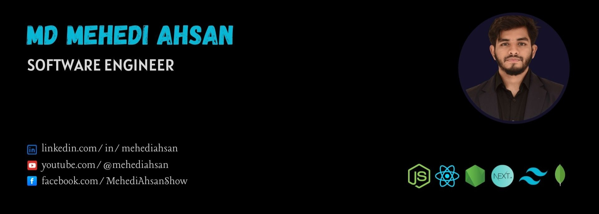

<!-- connection section -->

<h1  style='color: #7895B2'>✍🏻 About Me </h1>

Hello! I’m **Mehedi Ahsan**, a passionate and results-driven **Software Engineer** from Dhaka, Bangladesh.
With **2+ years of experience** in full-stack development, I focus on building scalable and efficient applications. I love solving real-world problems and crafting seamless digital experiences. I’m always open to opportunities where I can grow, contribute, and collaborate.

**Tech Focus:** JavaScript • React • Next.js • Node.js • Express.js • MongoDB

  <a href="https://www.youtube.com/@mehediahsan">YouTube</a> •
  <a href="https://www.linkedin.com/in/mehediahsan/">LinkedIn</a> •
  <a href="https://mehediahsan.vercel.app/">Portfolio</a> •
  <a href="https://twitter.com/MehediAhsan_">Twitter</a> • <a href="https://www.facebook.com/MehediAhsanShow">Facebook</a> • <a href="https://www.youtube.com/@mehediahsan">YouTube</a> 

<!-- overview section -->
 
<h1 align='left' style='color: #7895B2'> 💫 Current overview</h1>
 

### 🔎 Looking For

Seeking a **Software Engineer** role in a reputed company to leverage my skills and experience.  
📄 [My Resume](https://drive.google.com/file/d/1RZD9s02-2mGVW4ebX07avbt5a9IMg70N/view?usp=drive_link)

### 🚀 Exploring

Currently diving into **Three.js, AI-powered UI/UX, and Web Performance Optimization** to build smarter and more interactive applications..

### 🤝 Open to Collaborate

Excited to contribute to **open-source projects** and work with innovative developers.

### 💡 My Motivation

_"Act as if what you do makes a difference. It does."_

 
 
<h1 align='left' style='color: #7895B2'> 💻 Technologies</h1>
 

    
    
    
    
    
    
    
    
    
    
    
    
    
    
    

<!-- Youtube video here -->
 
<h1  align='left'  style='color: #7895B2'> 📼 Recent Videos</h1>
<ul style='display:flex; flex-wrap: wrap; justify-content: center; gap: 25px;'>
  <li><a href="https://youtu.be/hPECq-UrS7I?si=ga1ndTwCdaetMSWA">Building a Modern Website with React, Tailwind CSS, and ChatGPT</a></li>
  <li><a href="https://youtu.be/dS_QE0ltS1g?si=hFHg9iYef0RyocTv">Build a REST API with Node and Express js</a></li>
  <li><a href="https://youtu.be/aqZU8729Mb0?si=Wohpwz8qn_oubyvI">HTML Tutorial for Beginners: HTML Crash Course</a></li>

</ul>

 
<h1 align='left' style='color: #7895B2'> 🔥 My streak stats and more</h1>
 

  

 

 

-->
